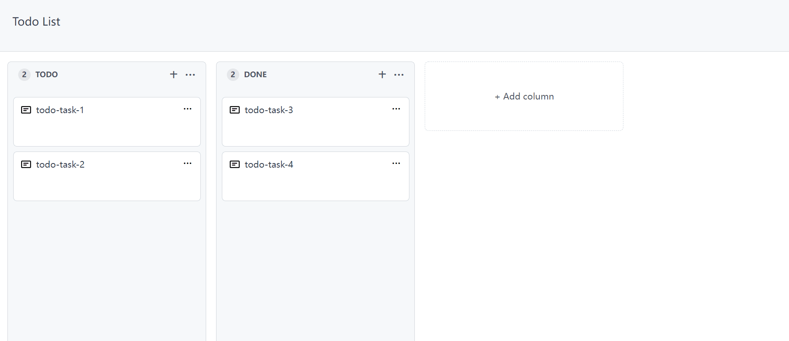

## 简介

**本项目是对 Vue3 Composition API 学习的 DEMO项目。**

TodoList 完成对GitHub旧版Projects界面的模仿实现，主要功能有对Todo任务栏、任务条的新增、删除与修改，并实现跨Column的任务条拖拽效果。

## 相关技术

### 前端

* 使用 TS + Vue3 开发，完全使用 setup-script 语法糖及 Composition API 进行编写
* pinia 作为全局状态管理工具
* tailwindcss 实现页面样式编写
* 抽离自定义hooks与自定义功能组件（包含拖拽hook、全局遮罩组件）

### 服务端（在 with-backend 分支）

* 使用Express搭建后端服务，连接MySQL实现数据持久化
* 使用Docker及Docker-compose统一部署项目

### 数据 mock （master 分支）
* 重构部分代码后单独实现了 [@wuxudongxd/todolist-devtool](https://www.npmjs.com/package/@wuxudongxd/todolist-devtool) 提供数据 mock 服务。
* 借助 msw 库调用 Service Worker 拦截请求，以 IndexedDB 数据库作为持久化存储，实现对请求的响应